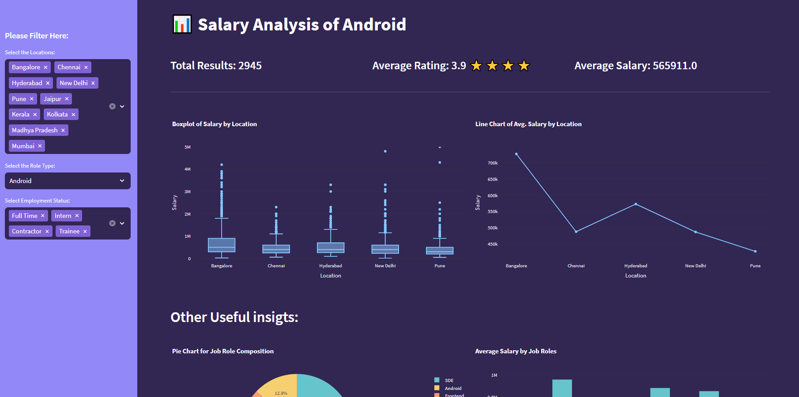

# :bar_chart: Software Employee Salary Analysis Dashboard 

**Description:** This project is an interactive dashboard that analyzes software employee salaries, allowing users to explore data on salary by location, company, and job title under various parameters like salary information, living indices and other relavent factors that impact the cost of living

## 📚 Documentation

This project performed salary data analysis based on the city living. The following steps were involved:

1. **Data Collection:** We gathered data on employee salaries in different cities and job roles from a kaggle dataset [Software Industry Salary Dataset - 2022](https://www.kaggle.com/datasets/iamsouravbanerjee/software-professional-salaries-2022) and cost of living indices from a crowd-sourced online database [Numbeo](https://www.numbeo.com/cost-of-living/country_result.jsp?country=India)
2. **Data Preprocessing:** We cleaned and preprocessed the collected data to handle outliers, and data quality issues. We ensured that the data was properly formatted and structured for analysis, unwanted columns are dropped.
3. **Salary and Living Expenses Comparison:** We compared the employee salaries with the cost of living in different cities. We calculated the salary-to-expenses ratio to assess the affordability and purchasing power of employees in each city. We considered adjusting the salary data based on factors such as inflation or currency exchange rates if analyzing data across different regions or countries.
4. **City Ranking:** We ranked the cities based on the affordability and attractiveness for employees. We considered using metrics such as the cost of housing as a percentage of salary, or the overall cost of living index to create a comparative ranking of cities.
5. **Visualization:** We created visualizations, such as bar charts, scatter plots, or heatmaps, to represent the salary data and living expenses across different cities. We used color coding or other visual cues to highlight variations in salary levels and living costs. This helped us in identifying cities that offered a better balance between salary and living expenses.
6. **Statistical Analysis:** We conducted statistical analysis to explore relationships between employee salaries and city living expenses. We used techniques such as correlation analysis, regression analysis, or hypothesis testing to understand the impact of living expenses on salary levels and identify any significant associations.
<!-- 7. **Salary Benchmarking:** We compared employee salaries against industry standards or benchmarks for each city. This provided insights into how salaries in a specific city compare to similar roles in other locations or industries. -->
7. **Insights and Recommendations:** We analyzed the findings from the data analysis to draw insights and make recommendations. We identified cities where employees had a higher purchasing power and considered those as potential areas for talent acquisition or employee relocation. We evaluated the competitiveness of salary packages in different cities and made adjustments if necessary.
<!-- 9. **Future Salary Planning:** We utilized the analysis results to inform future salary planning and decision-making. We considered adjusting salary structures or compensation packages based on the cost of living in different cities to attract and retain talent. -->

**Salary data analysis based on city living is just one factor to consider when making salary-related decisions. It's important to consider other factors such as market demand, job roles, skill requirements, and employee expectations to ensure a comprehensive and fair compensation strategy.**

## :computer: Steps To Run Locally and Make Changes

The following command is meant to run in a terminal or cmd

### First create a directory

    mkdir <dir_name>

### Change into to directory

    cd <dir_name>

### Clone this Repo to the present directory

    git clone https://github.com/Yaswanth14/Salary-Analysis.git .

### Create a Virtual Environment

    python3 -m venv <env_name>

### Activate the Virtual Environment

    <env_name>\Scripts\activate

### Install the required Dependencies using PIP

    pip install -r requirements.txt

### Run the app

    streamlit run app.py
